# GAMES101: Introduction to Computer Graphics

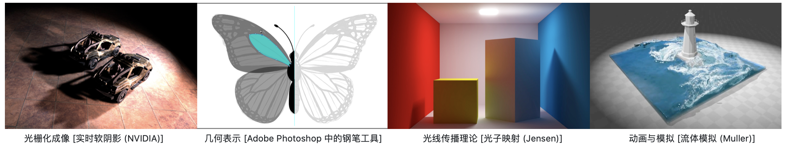

* This is the online course taught by [Ling-Qi Yan(闫令琪)](https://sites.cs.ucsb.edu/~lingqi/index.html) in Chinese and organized by [GAMES(Graphics And Mixed Environment Seminar)](http://games-cn.org/about-games/).
* Course Homepage can be found [here](https://sites.cs.ucsb.edu/~lingqi/teaching/games101.html).
* There are **eight assignments** and **one final project**. All eight assignments only need Eigen, OpenCV except assignment 8.
* My overall grade is [114.81 / 115](./imgs/grade.jpg). 
* Certificates can be found here([Chinese Version](./imgs/Chinese.jpg), [English Version](./imgs/English.jpg)).

## Assignment 1: Rotation and Projection
### Requirements
* Build the model matrix and the perspective projection matrix correctly
* Press the key to rotate the triangle or use the command line to get the rotated image
* [Bonus] Build the model matrix to rotate the triangle around any axis through the origin
### Results (grade: 35 / 35)

## Assignment 2: Triangles and Z-buffering
### Requirements
* Implement triangle rasterization algorithm
* Implement z-buffer algorithm and  draw triangles on the screen in order
* [Bonus] Implement super-sampling algorithm (anti-aliasing)
### Results (grade: 50 / 50)
* Raw result

* Result with MSAA

## Assignment 3: Pipeline and Shading
### Requirements
* Interpolate colors, normal vectors, texture coordinates, and position correctly
* Implement Blinn-phong reflection model correctly
* Implement Texture Mapping correctly
* Implement Bump mapping and Displacement mapping correctly
* [Bonus] Try more models: Find other available .obj files and render them
* [Bonus] Implement bilinear texture interpolation
### Results (grade: 58 / 58)
* The results from left to right are normal mapping, bump mapping, texture mapping, displacement mapping and Blinn-phong reflection model. 

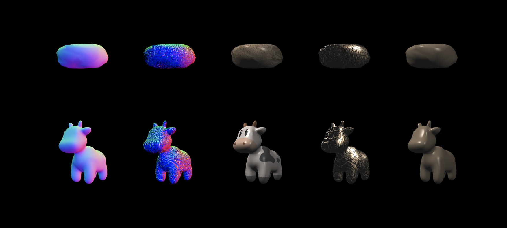

* Results w/o bilinear texture interpolation

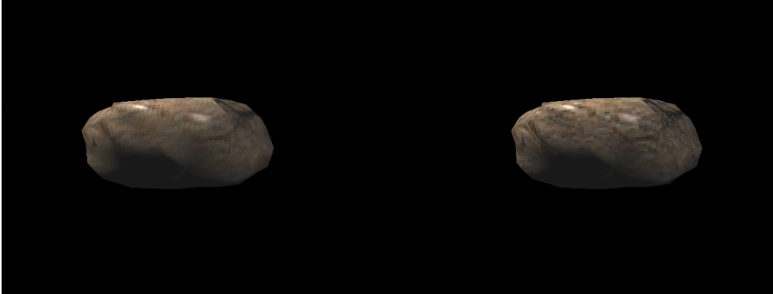

## Assignment 4: Bézier Curve
### Requirements
* Implement De Casteljau Algorithm
* [Bonus] Implement anti-aliasing of Bézier curve
### Results (grade: 40 / 40)
* Raw result

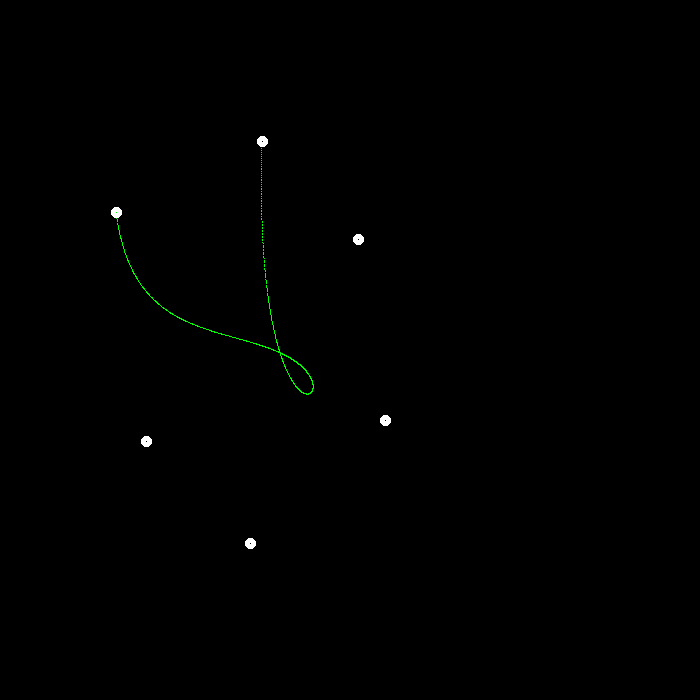

* Result with anti-aliasing

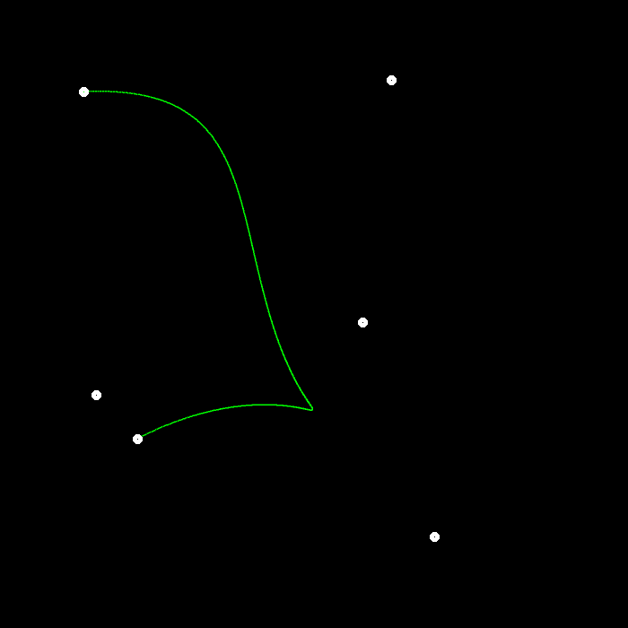

## Assignment 5: Intersection of Light and Triangle
### Requirements
* Implement the light generation part
* Implement the Moller-Trumbore algorithm
### Results (grade: 30 / 30)

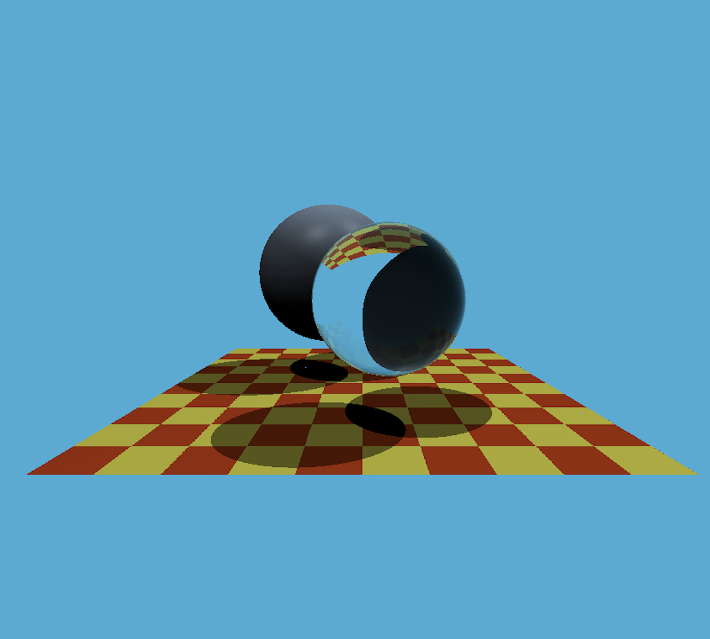

## Assignment 6: Sturcture of Acceleration
### Requirements
* Bounding Box Intersection: Correctly implement the intersection function of light and bounding box
* Implement BVH to accelerate the intersection of light and scene
* [Bonus] SAH search: learn SAH (Surface Area Heuristic) and implement SAH acceleration
### Results (grade: 60 / 60)
* Comparison
    * Time for creating BVH: 220 ms, time for rendering: 3274 ms
    * Time for creating SAH-BVH: 532 ms, time for rendering: 2921 ms
* Result of BVH

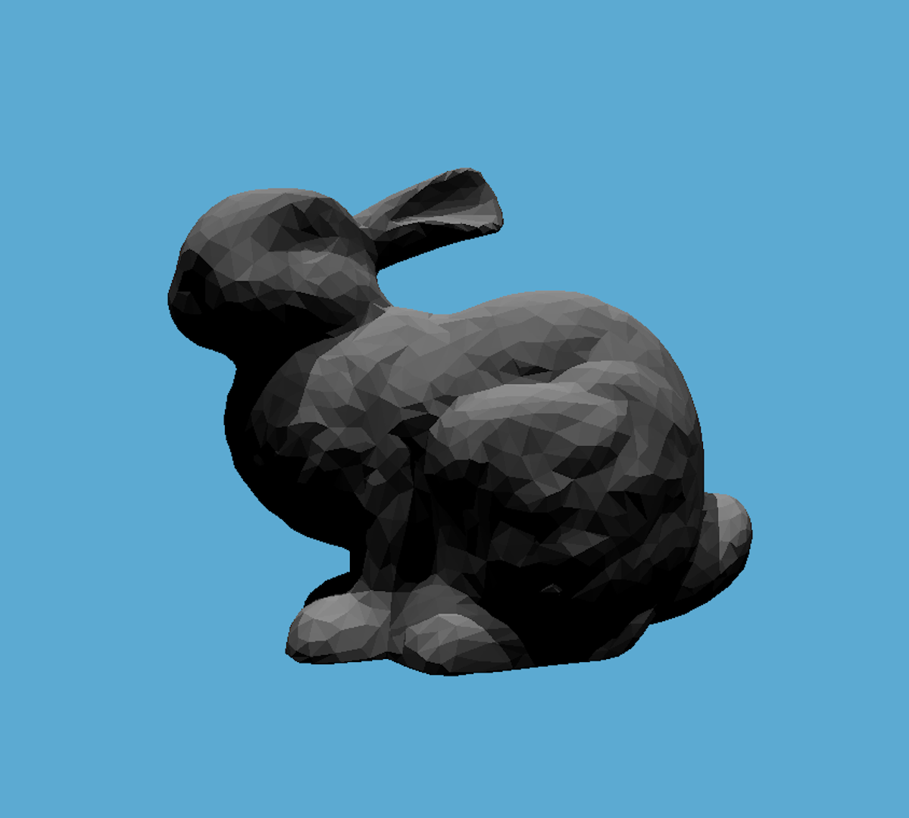

* Result of SAH

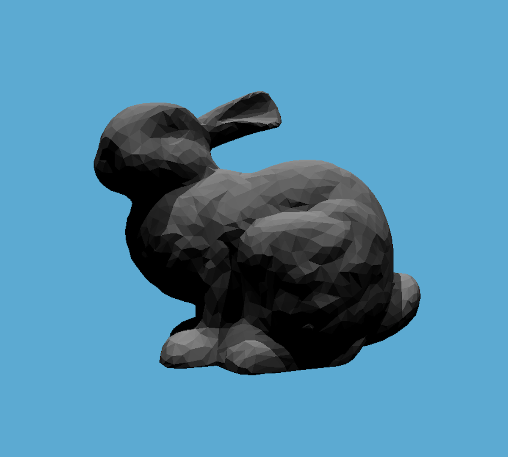

##  Assignment 7: Path Tracing
### Requirements
* Implement the Path Tracing Algorithm
* [Bonus] Multi-thread: Generate ray using multi-thread
* [Bonus] Microfacet: Implement the Microfacet material and submit the rendering results that reflect the nature of the Microfacet
### Results (grade: 69 / 70)
* Result of Ray Tracing

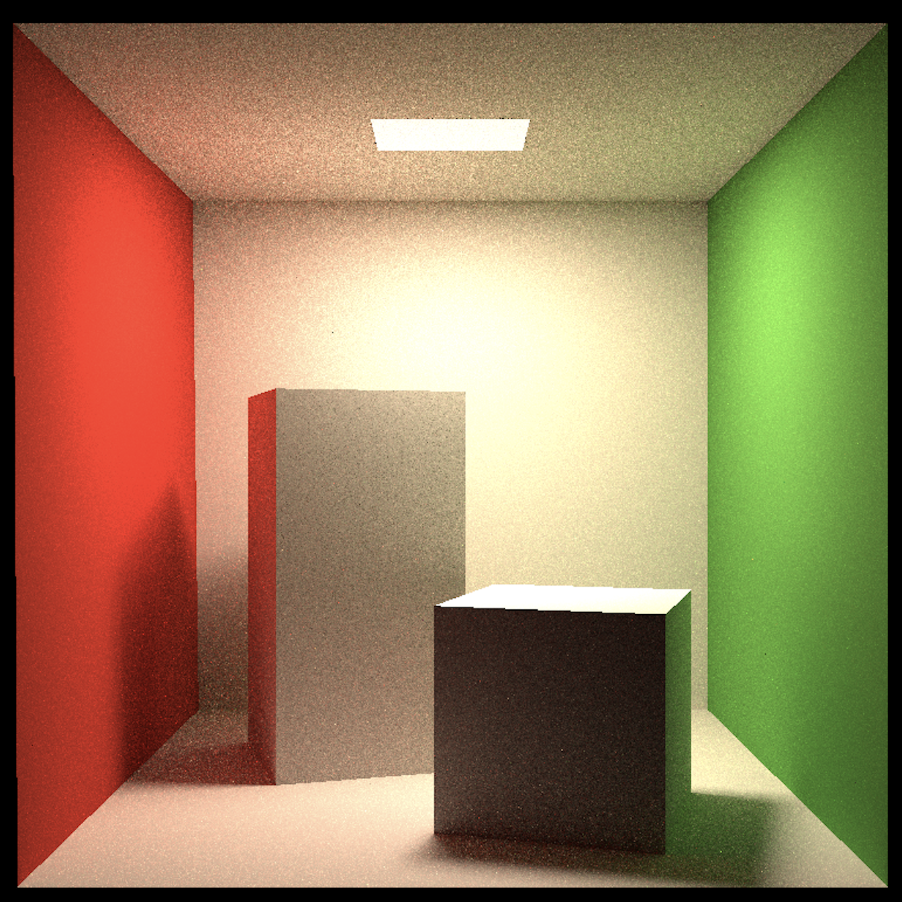

* Comparison (w/o multi-thread)
    * Resolution: 512, SSP = 16, running time: 1212 seconds
    * Resolution: 512, SSP = 16, running time: 641 seconds with OpenMP
* Microfacet material

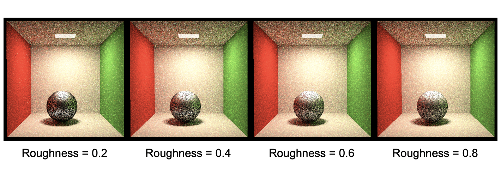

## Assignment 8: Mass-Spring System
### Requirements
* Connect the rope restraint, construct the rope correctly
* Implement the following methods: Semi-implicit Euler method, Explicit Euler method, Explicit Verlet and Damping
### Results (grade: 35 / 35)
* Result (Gif files will be provided soon)

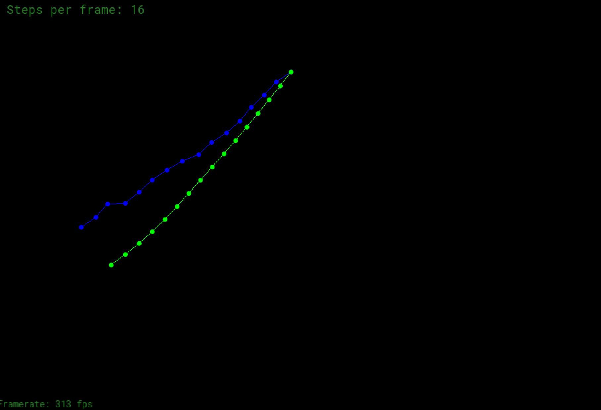

## Final Project: Hair Modeling and Rendering
### Hair Modeling
* Method
    * Input: an orientation map as input
    * Output: corresponding 3D hair model estimated by a neural network
* Programming Language / Framework / API
    * Python, PyTorch
* Reference
    * HairNet: Single-View Hair Reconstruction using Convolutional Neural Networks, ECCV 2018
### Hair Rendering 
* Methods:
    * Improved Kajiya-Kay Shading Model
* Programming Language / Framework / API
    * C++, OpenGL
* Reference
    * Rendering fur with three dimensional textures, SIGGRAPH 1989 
### Results
* **Grade: 95**
* **Due to confidentiality reasons, visual results are temporarily not provided.**
